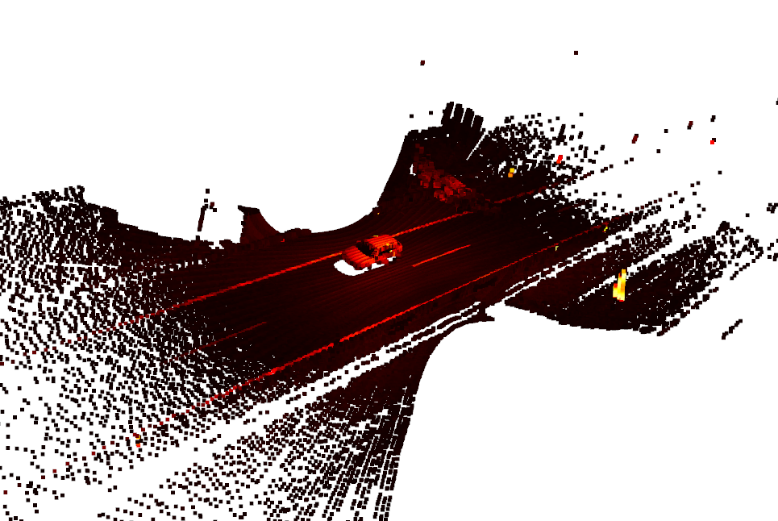

# Lidar Vehicle Clustering
This project applies clustering algorithms to LiDAR point cloud data to detect vehicles in a transportation infrastructure context. Specifically, this project focuses on vehicle detection using the DBSCAN and K-Means clustering algorithms, both on single-frame point clouds and across sequential frames in a video.

---

## Project Overview
Objective
Using LiDAR data, identify and cluster vehicles by first applying DBSCAN on a point cloud sample to detect the number of vehicles. Based on DBSCAN results, configure and apply the K-Means algorithm to identify these vehicles within the same data.

## Preprocessing
A key preprocessing step is to remove or mark LiDAR points representing the ground (road surface) to isolate vehicle clusters effectively.

## Steps
Single Image Clustering:

* DBSCAN: Perform DBSCAN clustering on a LiDAR frame to detect and estimate vehicle count.
* K-Means: Use K-Means to identify the same clusters based on initial DBSCAN configuration.

## Video Tracking:

Apply DBSCAN clustering across a sequence of LiDAR frames to detect vehicles within each frame, capturing clusters over time in a video sequence.

## Requirements
The project includes a Jupyter Notebook detailing the LiDAR data preprocessing, clustering using DBSCAN and K-Means, and the application of clustering on a sequence of LiDAR frames. It also includes the datapoints. 
